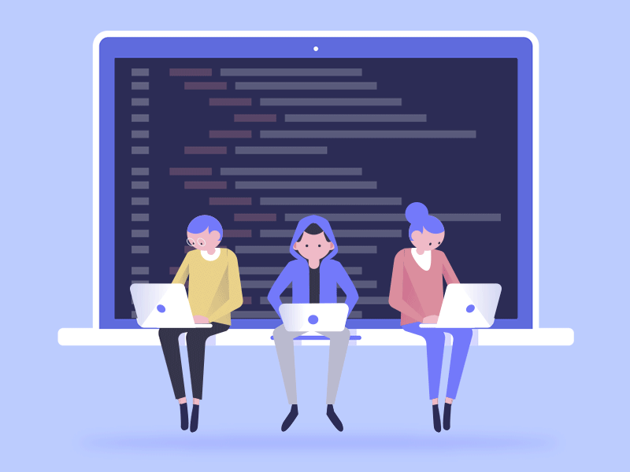

# 👋 hola me dicen (Alexy)

Dev, enfocado en crear soluciones innovadoras para un futuro tecnológico más avanzado. Transformo ideas en productos funcionales y escalables con un enfoque en eficiencia y optimización.

## 🚀 Sobre Mí

ex-estudiante ing de Software, enfocado en construir sistemas robustos y arquitecturas escalables. Mi pasión es el desarrollo tecnológico, y estoy comprometido con impulsar la innovación en Latinoamérica.

## 💡 Liderazgo y Mentoría

He liderado proyectos como GIO, donde he tenido la oportunidad de guiar y mentorizar a jóvenes programadores, ayudándolos a desarrollar sus habilidades técnicas y a transformar ideas en soluciones funcionales. Mi enfoque es innovar en soluciones Full Stack y Cloud que transformen procesos empresariales y generen un impacto real.

## 🛠️ Stack Tecnológico

| Lenguajes       | Frameworks      | Bases de Datos  | Cloud / DevOps         | Soluciones Renovables        | Metodologías |
|-----------------|-----------------|-----------------|------------------------|------------------------------|--------------|
| JavaScript      | Flutter         | PostgreSQL      | AWS                    | Sistemas de energía solar    | Agile        |
| Python          | React           | MySQL           | Azure                  | Optimización de recursos     | Scrum        |
| Java            | Angular         | MongoDB         | Google Cloud           | Tecnologías sostenibles      |              |
| C#              | Node.js         | Firebase        | Docker                 |                              |              |
|                 | Spring Boot     | Cassandra       | Kubernetes             |                              |              |
|                 | .NET            |                 | CI/CD (Jenkins, GitLab)|                              |              |

## 🌟 Proyectos Destacados

Aquí te presento algunos de mis proyectos más relevantes. Cada uno representa un desafío superado y una oportunidad para aplicar y expandir mis conocimientos en el desarrollo de software y soluciones innovadoras. ¡Explóralos!

### GIO

Plataforma de gestión integral para optimizar procesos empresariales, con módulos de CRM, ERP y BI. Desarrollado con React, Node.js y PostgreSQL.

### Enterpro

Ecosistema educativo gamificado para niños y jóvenes, enfocado en superar el miedo a las matemáticas, introducir educación financiera y dar una primera experiencia con el mundo del software y la tecnología. Una herramienta colaborativa para desarrolladores, docentes, padres y madres.

### 🚀 Lo que estoy construyendo ahora

Actualmente estoy explorando nuevas tecnologías y trabajando en proyectos personales. ¡Pronto habrá novedades aquí!

### 🔮 Roadmap Personal

Siempre estoy aprendiendo y mis próximos pasos incluyen explorar nuevas áreas. ¡Mantente atento a las actualizaciones!

